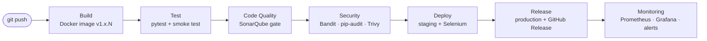

# 💳 Customer Transaction Analysis & Segmentation


A Streamlit data app that analyzes Company X's customer transaction data and segments customers using **RFM scoring**, turning raw transaction, card, and user data into actionable business recommendations.

The app is shipped through a fully automated **7-stage Jenkins DevOps pipeline**: Build → Test → Code Quality → Security → Deploy → Release → Monitoring. Every push to `main` is built, tested, analysed, scanned, deployed to staging, promoted to production and monitored with alerting, with no manual steps.

---

## 🌐 Overview

Company X provides financial products and services to individual customers and holds a large volume of customer transaction data. This project processes that data end-to-end — from raw CSVs to a live, interactive dashboard — to help Company X understand customer behavior, segment its customer base, and act on the findings.

### 🎯 Project Objectives
- **Understand Customer Behavior** — explore transaction patterns and trends across the dataset.
- **Build Customer Segments** — group customers with RFM (Recency, Frequency, Monetary) scoring.
- **Analyze Behavior per Segment** — profile each segment's spending and demographics.
- **Recommend Actions** — propose targeted strategies for each customer segment.
- **Deliver it like production software** — automated testing, quality gates, security scanning, versioned releases and live monitoring.

---

## 🚀 Key Features

### 🔒 Core Functionalities
- **Automated Data Pipeline** — load, clean, and merge 5 raw datasets into one analysis-ready table.
- **Exploratory Data Analysis (EDA)** — missing-value reporting, spending overview, channel/card-type breakdowns, yearly trends, top merchant categories.
- **RFM Customer Segmentation** — quantile-based scoring into 5 segments: Champions, Loyal Customers, Potential Loyalists, At Risk, Lost.
- **Interactive Dashboard** — 3-page Streamlit app (Dashboard, Analytics, Recommendation) for exploring results without touching code.

### 🌟 Highlighted Features
- **Before/After Cleaning Comparison** — visualizes missing-value ratios pre- and post-cleaning, directly from the raw tables.
- **Segment Profiling** — average recency, frequency, monetary value, age, income, and credit score per segment.
- **Business-Ready Recommendations** — concrete actions per segment, grounded in observed spending and MCC (merchant category) patterns.
- **Privacy by design** — card numbers and CVVs are dropped at load time, so they never reach the dashboard, charts, logs or metrics.
- **Built-in observability** — the app exports Prometheus metrics (version, dataset size, fraud rate, customers per segment, page render time, memory vs. container limit).

---

## 🏗️ System Architecture

### 💻 Technology Stack

| Category | Tools | Description |
|---|---|---|
| **Data Processing** | Python 3.12, Pandas, NumPy | Cleaning, merging, and numerical feature engineering |
| **Analysis** | Custom `EDA` & `CustomerSegmentation` classes | Spending analysis & RFM scoring |
| **Visualization** | Matplotlib, Seaborn | Static charts rendered into the dashboard |
| **App / UI** | Streamlit | Multi-page interactive dashboard |
| **CI/CD** | Jenkins (Pipeline as Code), Docker, Docker Compose | Automated build, test, deploy and release |
| **Testing** | pytest, pytest-cov, Streamlit AppTest, Selenium | Unit, integration and end-to-end browser tests |
| **Code Quality** | SonarQube, flake8, hadolint, shellcheck | Quality gate, code smells, duplication, complexity |
| **Security** | Bandit, pip-audit, Trivy | SAST, dependency CVEs, image CVEs, SBOM, secret scanning |
| **Monitoring** | Prometheus, Alertmanager, Grafana, Blackbox exporter | Metrics, dashboards, e-mail alerts |
| **Version Control** | GitHub (repository, tags, Releases) | Code, versioned releases and dataset hosting |

### 🔁 CI/CD Pipeline



| # | Stage | What happens | Gate (fails the build) |
|---|---|---|---|
| 1 | **Build** | Versioned Docker image (`VERSION` + build number), tagged by version and commit, pushed to a local registry; digest recorded in `build-info.json` | build or push error |
| 2 | **Test** | 70+ unit & integration tests (incl. Streamlit pages), then a smoke test of the built container | any failing test, coverage < 80 % |
| 3 | **Code Quality** | flake8, hadolint, shellcheck, SonarQube analysis with a custom quality gate ("CS Gate") | quality gate failed |
| 4 | **Security** | Bandit (SAST), pip-audit (dependencies), Trivy (image CVEs, CycloneDX SBOM, secrets, misconfig) in parallel | HIGH Bandit issue, vulnerable dependency, fixable CRITICAL CVE, secret/misconfig |
| 5 | **Deploy** | Docker Compose deploy to **staging**, health + version check, **automatic rollback**, Selenium browser tests | unhealthy deploy, failing e2e test |
| 6 | **Release** | Full dataset downloaded and SHA-256 verified, **same image** promoted to **production**, e2e tests, git tag `v<version>` and GitHub Release with SBOM | any failure (production rolled back) |
| 7 | **Monitoring** | Prometheus/Alertmanager/Grafana stack updated and verified, release annotation, optional incident simulation | monitoring not healthy, alert not firing |

Builds are triggered automatically by every commit (Jenkins polls GitHub). Full details: **[docs/PIPELINE.md](docs/PIPELINE.md)** · Security controls and findings: **[SECURITY.md](SECURITY.md)**.

### 📦 Project Structure

```
Customer-Segmentation-Analysis/
├── Jenkinsfile                  # 7-stage declarative pipeline (Pipeline as Code)
├── Dockerfile                   # App image: Python 3.12 slim, non-root, healthcheck
├── VERSION                      # Major.minor version; Jenkins appends the build number
├── sonar-project.properties     # SonarQube analysis settings
├── SECURITY.md                  # Security controls, gating policy, findings register
├── requirements-dev.txt         # CI tooling (pytest, flake8, bandit, pip-audit, selenium)
│
├── src/
│   ├── app.py                   # Streamlit entry point & page navigation
│   ├── serve.py                 # Container entry point: metrics exporter + Streamlit
│   ├── telemetry.py             # Prometheus metrics for the app
│   ├── requirements.txt         # Direct runtime dependencies (pinned)
│   ├── requirements.lock        # Fully resolved, hash-verified lock file
│   ├── data/                    # Small CSVs, sample/ dataset, dataset.sha256
│   ├── model/
│   │   ├── AttitudeAnalysis.py      # Main entry point: load → clean → merge → EDA → segment → visualize
│   │   ├── DataLoader.py            # Reads the 5 raw CSV files (supports DATA_DIR)
│   │   ├── TableCleaner.py          # Cleans each raw table individually
│   │   ├── Merger.py                # Merges cleaned tables into one master table
│   │   ├── EDA.py                   # Answers the project's guiding analysis questions
│   │   ├── CustomerSegmentation.py  # Builds RFM scores and assigns segments
│   │   └── Visualizer.py            # Generates and saves all charts
│   └── views/
│       ├── Dashboard.py         # EDA tables: missing values, spending, trends, segment profile
│       ├── Analytics.py         # Chart gallery: all Visualizer outputs
│       └── Recommendation.py    # Business recommendations per segment
│
├── tests/                       # unit/, integration/, e2e/ (Selenium), synthetic data factory
├── scripts/                     # make_sample.py, package_dataset.py (large-data tooling)
├── ci/                          # One script per pipeline stage (runnable locally too)
├── deploy/                      # Compose file + staging.env / production.env
├── infra/                       # Jenkins, SonarQube, registry (docker compose)
├── monitoring/                  # Prometheus, Alertmanager, Grafana, alert rules + tests
└── docs/PIPELINE.md             # Pipeline documentation and runbook
```

---

## 📊 Dataset

The dataset is a comprehensive financial dataset covering customer transactions, cards, and user profiles from banking institutions over **2010–2019**, made up of 5 tables:

| Table | Description |
|---|---|
| **Transaction Data** | Every transaction: amount, date, channel (Swipe/Chip/Online), merchant, errors |
| **Card Data** | Card brand/type, credit limit, chip status, dark-web exposure flag |
| **Merchant Category (MCC) Data** | Merchant category codes and descriptions |
| **Fraud Labels Data** | Whether a transaction was flagged as fraudulent |
| **User Data** | Age, income, debt, credit score, and other demographics |

### 📁 Handling the large files

`transactions_data_25pc.csv` (~300 MB) and `train_fraud_labels.csv` (~110 MB) exceed GitHub's file-size limit, so **data is versioned separately from code**:

| Where | What | Used by |
|---|---|---|
| `src/data/*.csv` (Git) | cards, users and MCC tables (small) | everything |
| `src/data/sample/` (Git) | ~2 % random sample of transactions + matching fraud labels, card numbers/CVVs removed | tests, container smoke test, staging |
| `src/data/dataset.sha256` (Git) | SHA-256 checksums of the full files | integrity check |
| **GitHub Release [`dataset-v1`](../../releases/tag/dataset-v1)** | `transactions_data_25pc.csv.gz`, `train_fraud_labels.csv.gz` | production (downloaded and verified by Jenkins) |

The sample and the release archives are produced with `python scripts/make_sample.py` and `python scripts/package_dataset.py`.

---

## 🔄 Data Pipeline

1. **Load** — `DataLoader` reads all 5 CSVs (from `src/data/` or the folder given by `DATA_DIR`).
2. **Clean** — `TableCleaner` handles each table individually: strips currency symbols, imputes missing values (median for numeric, mode for categorical), converts ID columns to clean strings, parses dates, derives flags like `is_error` and `is_fraud`, and drops card numbers and CVVs (never used by the analysis).
3. **Merge** — `Merger` joins all tables into one transaction-level master table (`card_id`, `client_id`, and `mcc` as join keys).
4. **Analyze** — `EDA` computes missing-value reports, spending overviews, channel/card-type breakdowns, yearly trends, and top merchant categories.
5. **Segment** — `CustomerSegmentation` builds an RFM table per customer and scores it into 5 segments.
6. **Visualize** — `Visualizer` renders and saves every chart used across the dashboard.

---

## 🧮 RFM Segmentation Methodology

| Metric | Definition |
|---|---|
| **Recency** | Days since a customer's most recent transaction |
| **Frequency** | Total number of transactions per customer |
| **Monetary** | Total amount spent by the customer |

Each metric is scored 1–4 using quantiles, summed into an `RFM_score`, and mapped to a segment:

| RFM Score | Segment |
|---|---|
| 10–12 | Champions |
| 8–9 | Loyal Customers |
| 6–7 | Potential Loyalists |
| 4–5 | At Risk |
| 0–3 | Lost |

---

## 💡 Key Recommendations

- **Champions** — small but highest-spending group → VIP/loyalty programs and personalized offers.
- **Potential Loyalists** — largest group, lower spending → upselling, cross-selling, increase transaction frequency.
- **At Risk** — declining spend → win-back campaigns with discounts or cashback.
- **Lost** — low spend → low-cost reactivation only; stop investing if unresponsive.
- Grocery, Food Stores, and Service Stations are the top merchant categories → cashback/rewards partnerships through these merchants.
- Online transactions have the highest-value outliers → strengthen online fraud detection.
- Transaction value grew steadily until ~2015 then plateaued → prioritize new customer acquisition and product expansion.

---

## ▶️ How to Run

### Option 1 — Locally (Python 3.12)

```bash
python -m venv .venv
# Windows: .venv\Scripts\activate      macOS/Linux: source .venv/bin/activate
pip install --require-hashes -r src/requirements.lock
pip install -r requirements-dev.txt      # only needed for tests and linters

cd src
streamlit run app.py                     # open http://localhost:8501
```

- **Full dataset:** download the two `.gz` files from the [`dataset-v1` release](../../releases/tag/dataset-v1), unzip them into `src/data/`.
- **Quick start without downloading:** run on the committed sample instead:
  - Windows PowerShell: `$env:DATA_DIR="data/sample"; streamlit run app.py`
  - macOS/Linux: `DATA_DIR=data/sample streamlit run app.py`

### Option 2 — Docker

```bash
docker build -t cs-app .
docker run --rm -p 8501:8501 cs-app      # serves the sample dataset baked into the image
```

### Option 3 — The full DevOps platform

```bash
docker compose -f infra/docker-compose.yml up -d --build
```

This starts Jenkins, SonarQube and a local Docker registry. Configure the credentials and the Pipeline job as described in [docs/PIPELINE.md](docs/PIPELINE.md#6-one-time-setup-summary); from then on, every push runs the whole pipeline.

| Service | URL |
|---|---|
| Production app | http://localhost:8501 |
| Staging app | http://localhost:8502 |
| Jenkins | http://localhost:8080 |
| SonarQube | http://localhost:9000 |
| Grafana | http://localhost:3000 |
| Prometheus | http://localhost:9090 |
| Alertmanager | http://localhost:9093 |

### Configuration

| Variable | Default | Purpose |
|---|---|---|
| `DATA_DIR` | `src/data` | Folder containing the 5 CSV files |
| `CHART_DIR` | `charts` | Where generated charts are written |
| `METRICS_ENABLED` | `true` | Turn the Prometheus exporter on/off |
| `METRICS_PORT` / `METRICS_ADDR` | `8000` / `127.0.0.1` | Exporter port and bind address (`0.0.0.0` inside Docker) |
| `APP_VERSION`, `APP_ENV` | `dev`, `local` | Shown in the sidebar and in the `cs_app_info` metric |

---

## 🧪 Testing

```bash
pytest -m "not e2e"                      # unit + integration tests (~96 % coverage)
pytest -m "not e2e" --cov --cov-report=term
flake8 src tests scripts                 # style + complexity
bandit -r src scripts                    # security linting
```

- **Unit tests** — cleaning rules, merge logic, EDA, RFM scoring thresholds, data loader, charts, telemetry, dataset scripts.
- **Integration tests** — the full load → clean → merge → segment pipeline, a data contract for the committed sample, and every Streamlit page rendered headlessly with `AppTest`.
- **End-to-end tests** — Selenium opens the deployed app in Chromium, checks every page and chart, and saves screenshots (run by Jenkins after each deployment).

Unit tests use a seeded synthetic dataset (`tests/data_factory.py`), so they never depend on the large files.

---

## 📈 Monitoring & Alerting

The app exposes Prometheus metrics on an internal port (`/metrics`), including the running version, rows loaded, fraud rate, customers per segment, page views/errors, page render time, and memory/CPU usage relative to the container limits.

| Alert | Severity | Fires when |
|---|---|---|
| `CSAppDown` | critical | health check fails for 30 s |
| `CSDataPipelineFailed` | critical | loading/cleaning/segmenting the data raised an error |
| `CSMetricsTargetDown` | warning | metrics endpoint unreachable for 1 min |
| `CSHighMemoryUsage` | warning | memory > 85 % of the container limit |
| `CSHighCPU` | warning | CPU > 90 % of the container limit for 5 min |
| `CSSlowHealthCheck` | warning | health check slower than 2 s |
| `CSPageErrors` | warning | a dashboard page raised an exception |

Alerts are e-mailed by Alertmanager and every alert rule is unit-tested with `promtool`. Running the pipeline with `SIMULATE_INCIDENT=true` stops production on purpose and measures time-to-detect and time-to-recover.

---

## 🔮 Future Work

- **Fraud prediction** — train a classification model on the existing fraud labels to flag suspicious transactions.
- **Churn prediction** — predict which customers are likely to move into the *At Risk* segment so Company X can act early.
- **MLOps pipeline** — add model training and evaluation stages with quality thresholds, versioned models in a model registry, and model-performance / data-drift monitoring in Grafana.
- **Data versioning with DVC** — replace GitHub Release assets with DVC backed by cloud storage (e.g. Amazon S3).

---

## 🎥 Video Demo

[**Video Demo: Customer Transaction Analysis & Segmentation — DevOps Pipeline with Jenkins**](ADD_VIDEO_LINK_HERE)

---

## 📬 Contact

**Author:** _[MinhMan1301]_
📧 Email: [phamminhman13012005@gmail.com](mailto:phamminhman13012005@gmail.com)
🔗 GitHub: [MinhMan1301](https://github.com/MinhMan1301)
🔗 LinkedIn: [NGUYEN MINH MAN PHAM](https://www.linkedin.com/in/nguyen-minh-man-pham-47b493311/)