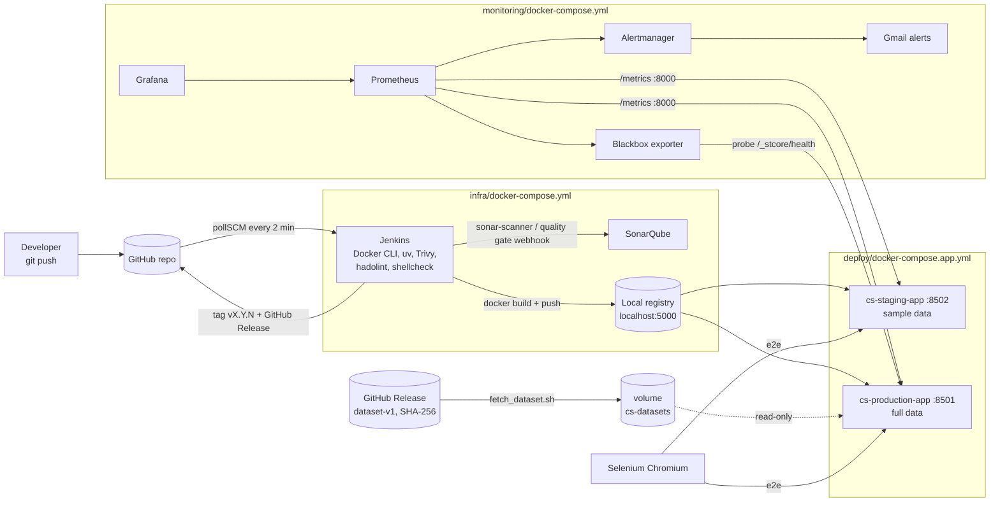

# CI/CD Pipeline - Customer Segmentation Analysis

A 7-stage Jenkins pipeline that builds, tests, analyses, secures, deploys, releases and monitors
the Streamlit customer-segmentation dashboard. Everything runs locally in Docker, so the whole
setup can be reproduced from this repository.

## 1. Architecture



All containers share the Docker network `devops-net`, so Jenkins, Selenium and Prometheus reach
the apps by container name (`cs-staging-app`, `cs-production-app`).

## 2. Stages and tools

| # | Stage | What happens | Tools | Gate |
|---|---|---|---|---|
| 1 | **Build** | Version = `VERSION` file + build number (e.g. `1.0.42`). Docker image built with OCI labels, tagged `:<version>` and `:sha-<commit>`, pushed to the registry, digest stored in `build-info.json` (fingerprinted). | Docker Buildx, local registry | build/push must succeed |
| 2 | **Test** | 70+ unit + integration tests (cleaning, merge, EDA, RFM segmentation, loader, charts, telemetry, entrypoint, Streamlit pages via `AppTest`, sample-data contract). Then a **container smoke test**: health endpoint, `/metrics` reports the new version, data pipeline runs inside the image. | pytest, pytest-cov, streamlit.testing, JUnit + Coverage plugins | any failing test, coverage < 80% |
| 3 | **Code Quality** | flake8 (style, cyclomatic complexity 10) imported into SonarQube; hadolint on every Dockerfile (policy in `.hadolint.yaml`, trusted registries only); shellcheck on every CI script; SonarQube analysis with coverage + test results; pipeline waits for the quality gate. | flake8, hadolint, shellcheck, SonarQube + SonarScanner | syntax/undefined-name errors, hadolint errors, shellcheck warnings, SonarQube quality gate "CS Gate" |
| 4 | **Security** | Three parallel scans: Bandit (SAST), pip-audit (CVEs in every package of the hash-locked `src/requirements.lock`), Trivy (image CVEs, SBOM, secrets, Dockerfile misconfig). See `SECURITY.md`. | Bandit, pip-audit, Trivy | HIGH Bandit issue, any vulnerable dependency, fixable CRITICAL image CVE, HIGH+ secret/misconfig |
| 5 | **Deploy** | `docker compose up --wait` to **staging** (sample data), health + version verification with automatic rollback, then Selenium browser tests of all pages plus a check of the internal `/metrics` endpoint (version + dataset size). | Docker Compose, Selenium | unhealthy deploy (auto-rollback), failing e2e (rollback) |
| 6 | **Release** | Full dataset downloaded from the GitHub Release and SHA-256 verified; **production** deploy (same image, production config), health/version checks, Selenium tests on production (including `cs_dataset_rows >= 100000`, which proves the full dataset from the release is served, not the sample), then `:stable` tag, git tag `v<version>` and a GitHub Release with `build-info.json` and the SBOM attached. | Docker Compose, GitHub REST API, git | any failure → production rolled back to the previous release |
| 7 | **Monitoring** | Prometheus/Alertmanager/Blackbox/Grafana started or updated; config validated (`promtool`, alert-rule unit tests, `amtool`); Jenkins verifies that production is scraped and probed, lists targets and alerts, adds a release annotation to Grafana. Optional `SIMULATE_INCIDENT` stops production and measures time-to-detect and time-to-recover. | Prometheus, Alertmanager (email), Blackbox exporter, Grafana | monitoring must be healthy and scraping; incident alert must fire and resolve |

Pass/fail evidence for every stage is archived under `reports/` in each build.

## 3. Handling the large data files

`transactions_data_25pc.csv` and `train_fraud_labels.csv` are too large for Git, so data is
versioned separately from code:

| Where | Data | Why |
|---|---|---|
| Git: `src/data/*.csv` | cards, users, MCC codes (small) | needed everywhere |
| Git: `src/data/sample/` | ~2 % random sample of transactions + matching fraud labels | baked into the image; used by the smoke test and staging |
| Git: `src/data/dataset.sha256` | SHA-256 of the two `.gz` archives **and** of the unpacked CSV files | integrity check before and after decompression |
| GitHub Release `dataset-v1` | `transactions_data_25pc.csv.gz`, `train_fraud_labels.csv.gz` | production data, downloaded by `ci/fetch_dataset.sh` once and cached in the `cs-datasets` volume |
| Generated in tests | synthetic tables (`tests/data_factory.py`) | fast, deterministic unit/integration tests |

Create them with `python scripts/make_sample.py` and `python scripts/package_dataset.py`.
A new dataset version means a new release tag (`dataset-v2`), a new manifest and updating
`DATASET_TAG` in the Jenkinsfile and `DATA_DIR` in `deploy/production.env`.

## 4. Environments

| | Staging | Production |
|---|---|---|
| URL | http://localhost:8502 | http://localhost:8501 |
| Data | sample inside the image | full dataset, read-only volume |
| Limits | 1 GB RAM, 1 CPU | 6 GB RAM, 2 CPUs |
| Config | `deploy/staging.env` | `deploy/production.env` |
| Rollback | `bash ci/deploy.sh rollback staging` | `bash ci/deploy.sh rollback production` |

Deployment history is written to `/var/jenkins_home/deploy-state/history.log`.

## 5. Application telemetry (`src/telemetry.py`)

| Metric | Meaning |
|---|---|
| `cs_app_info{version,git_sha,env}` | which build is running (used by deploy verification and e2e) |
| `cs_data_pipeline_runs_total{status}`, `cs_data_pipeline_duration_seconds`, `cs_data_pipeline_last_success_timestamp_seconds` | data-pipeline health |
| `cs_dataset_rows`, `cs_fraud_rate_ratio`, `cs_customers_per_segment{segment}` | business metrics |
| `cs_page_views_total{page}`, `cs_page_errors_total{page}`, `cs_page_render_seconds{page}` | usage, errors and page performance |
| `cs_container_memory_limit_bytes`, `cs_container_cpu_limit_cores` + `process_*` | resource usage vs container limits (read from cgroups) |

The exporter listens on `127.0.0.1` by default; the Docker image sets `METRICS_ADDR=0.0.0.0`
because Prometheus scrapes it over `devops-net` (port 8000 is never published to the host).

Alert rules (`monitoring/prometheus/alert_rules.yml`, unit-tested in `alert_rules_test.yml`):
CSAppDown (critical), CSDataPipelineFailed (critical), CSMetricsTargetDown, CSHighMemoryUsage,
CSHighCPU (relative to the container CPU limit), CSSlowHealthCheck, CSPageErrors (warnings). Alerts are grouped per environment and e-mailed;
"target down" is inhibited while "app down" fires.

## 6. One-time setup (summary)

1. `docker compose -f infra/docker-compose.yml up -d --build`
2. Jenkins http://localhost:8080 - unlock with `docker exec jenkins cat /var/jenkins_home/secrets/initialAdminPassword`.
3. SonarQube http://localhost:9000 (admin/admin, then change it):
   - My Account → Security → generate a *Global Analysis Token*.
   - Quality Gates → Create **CS Gate** → conditions on *Overall Code*: Coverage < 80 % fails,
     Duplicated Lines (%) > 3 fails, Maintainability / Reliability / Security Rating worse than A fails;
     on *New Code*: Coverage < 80 %. Set it as default.
   - Quality Profiles → Python → copy *Sonar way* to **CS Python**, change rule S3776
     (Cognitive Complexity) threshold 15 → 10, set as default.
   - Administration → Configuration → Webhooks → `http://jenkins:8080/sonarqube-webhook/`.
4. Jenkins credentials: `github-creds` (username + fine-grained PAT, Contents: read/write),
   `sonarqube-token` (secret text), `smtp-creds` (Gmail + app password), `grafana-admin`.
5. Manage Jenkins → System: SonarQube server `SonarQube` = `http://sonarqube:9000`; Extended E-mail (smtp.gmail.com:587, TLS).
   Tools: SonarQube Scanner installation named `SonarScanner` (install automatically).
6. New Item → Pipeline → *Pipeline script from SCM* → Git, branch `*/main`, script path `Jenkinsfile`.

## 7. Updating Python dependencies

`src/requirements.txt` lists the direct dependencies; the image and CI install the fully
resolved, hash-verified `src/requirements.lock`. After changing a version:

```bash
uv pip compile src/requirements.txt --universal --generate-hashes --python-version 3.12 -o src/requirements.lock
```

## 8. Running stages locally

```bash
bash ci/test.sh                     # same tests as Jenkins
bash ci/security.sh bandit          # or pip-audit / trivy
APP_VERSION=1.0.0 REGISTRY=localhost:5000 APP_NAME=cs-app bash ci/deploy.sh deploy staging
```

## 9. Troubleshooting

| Symptom | Fix |
|---|---|
| `bash\r: No such file or directory` | line endings: `git add --renormalize .` (`.gitattributes` forces LF) |
| `permission denied ... docker.sock` | Jenkins must run as root (already set in `infra/docker-compose.yml`) |
| Quality gate step waits forever | missing SonarQube webhook to `http://jenkins:8080/sonarqube-webhook/` |
| `network devops-net not found` | start the platform compose first (it creates the network and volume) |
| Production OOM / exit 137 | increase `MEM_LIMIT` in `deploy/production.env` and Docker Desktop memory |
| SonarQube container restarts (Elasticsearch) | give Docker Desktop more memory; if needed run `wsl -d docker-desktop sysctl -w vm.max_map_count=262144` |
| Push to `localhost:5000` refused | registry container not running: `docker ps --filter name=cs-registry` |
